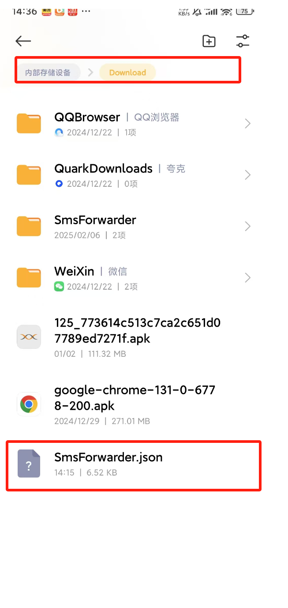

# 电脑接短信电话--实现短信验证码、来电提醒自动在PC端同步

## 效果展示

收到验证码后，自动拦截短信发送到电脑端，在电脑右下角有托盘消息提示，并自动复制到Windows剪贴板中，直接粘贴就可以。


## 安装使用步骤

### 1.安装SmsForwarder

在安卓手机上安装短信转发器SmsForwarder
https://github.com/pppscn/SmsForwarder

### 2.SmsForwarder配置导入，通用设置开关要重新关闭打开一次
将[SmsForwarder.json](SmsForwarder.json)放在
/storage/emulated/0/Download目录下，点击导入开始导入



### 3.发送通道-修改Socket tcp配置

需要手机与电脑在同一局域网下，修改服务端ip为电脑自己的局域网ip


### 4.下载SMSOTPServer.exe 电脑上点击启动
https://github.com/ddonano/SMSOTPServer/releases


### 5. 找个验证码网页开始测试


## 如何编译打包工程

**将代码clone到本地部署运行**

clone项目

```bash
git clone git@github.com:ddonano/SMSOTPServer.git
cd SMSOTPServer
```

安装依赖

```bash
pip install -r requirements.txt
```

运行`main.py`,如果需要修改端口号 加启动参数 -p {port}

```bash
python main.py
```

打包成exe启动

```bash
pyinstaller -F --add-data "config.json;." --add-data "favicon.ico;." --icon="favicon.ico" --name="SMSOTPServer" main.py
```
启动,直接点击exe打开即可，或者在cmd命令行里修改端口号启动 
```bash
SMSOTPServer.exe -p 65431
```
加入windows自启动，创建SMSOTPServer.exe 快捷方式，按win+R 输入shell:startup执行， 在打开的文件夹里拖入刚创建的快捷方式即可。


